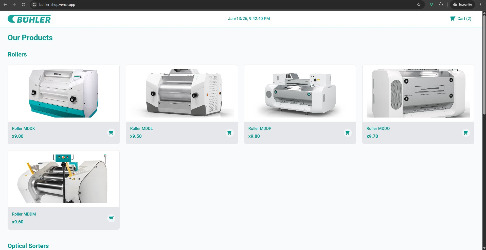
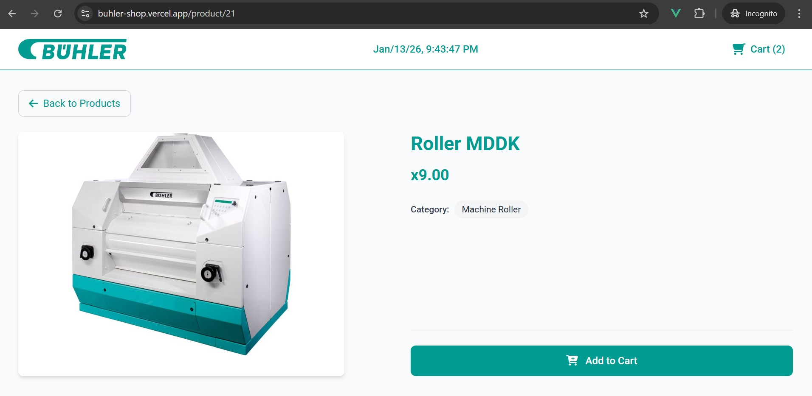
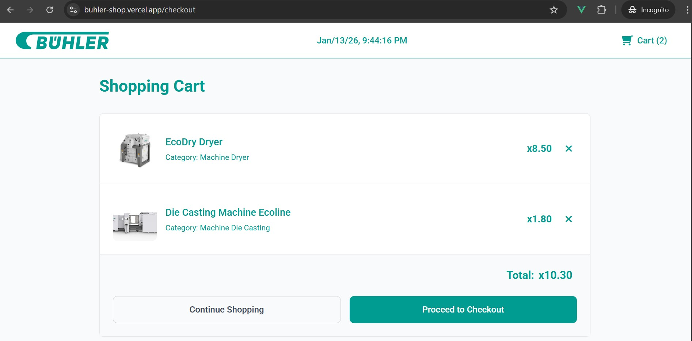

# Bühler Shop

A modern e-commerce application showcasing Bühler's industrial machinery products. Built with Vue 3 and featuring a clean, responsive design with real-time shopping cart functionality.

**Live Demo:** [https://buhler-shop.vercel.app/](https://buhler-shop.vercel.app/)

## Screenshots

### Product Listing Page

*Browse products organized by categories with clean card layouts*

### Product Detail Page  

*Detailed product view with add to cart functionality*

### Shopping Cart

*Real-time cart management with item removal and totals*

## Technologies Used

- **Vue 3** - Progressive JavaScript framework with Composition API
- **TypeScript** - Type-safe JavaScript development
- **Vite** - Fast build tool and development server
- **Tailwind CSS** - Utility-first CSS framework
- **Pinia** - Vue state management library
- **Vue Router 4** - Client-side routing
- **Axios** - HTTP client for API requests
- **Font Awesome** - Icon library
- **SCSS** - CSS preprocessor
- **Vercel** - Deployment 

## Prerequisites

- **Node.js** version 18.x or higher
- **npm** package manager

## Setup & Installation

1. **Clone the repository**
   ```bash
   git clone <repository-url>
   cd buhler-shop
   ```

2. **Install dependencies**
   ```bash
   npm install
   ```

3. **Start development server**
   ```bash
   npm run dev
   ```

4. **Build for production**
   ```bash
   npm run build
   ```

5. **Preview production build**
   ```bash
   npm run preview
   ```

## Features

- **Product Catalog** - Browse products by categories
- **Product Details** - View detailed product information
- **Shopping Cart** - Add/remove items with real-time updates
- **Responsive Design** - Works seamlessly on all devices
- **Bühler Branding** - Custom color scheme and professional design

## Project Structure

```
src/
├── components/          # Reusable Vue components
├── pages/              # Page components (views)
├── stores/             # Pinia state management
├── services/           # API service layer
├── types/              # TypeScript type definitions
├── router/             # Vue Router configuration
└── assets/             # Static assets (images, logos)
```

## Design System

The application uses Bühler's brand color (`#009b91`) throughout the interface, ensuring consistent branding and a professional appearance.

---

Built with ❤️ for Bühler